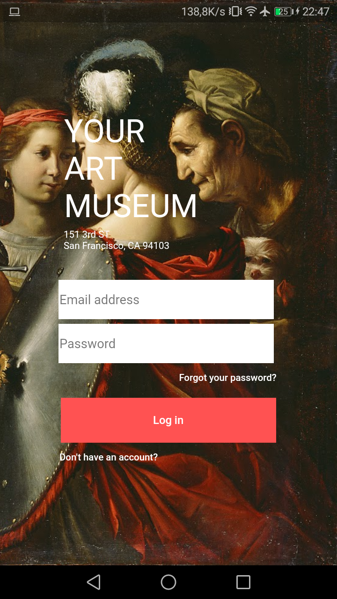
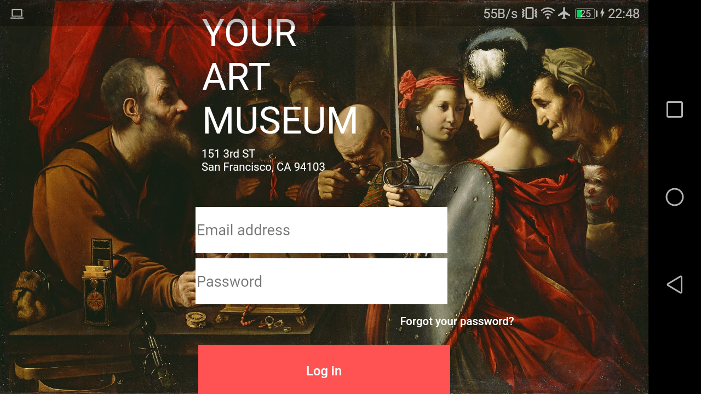
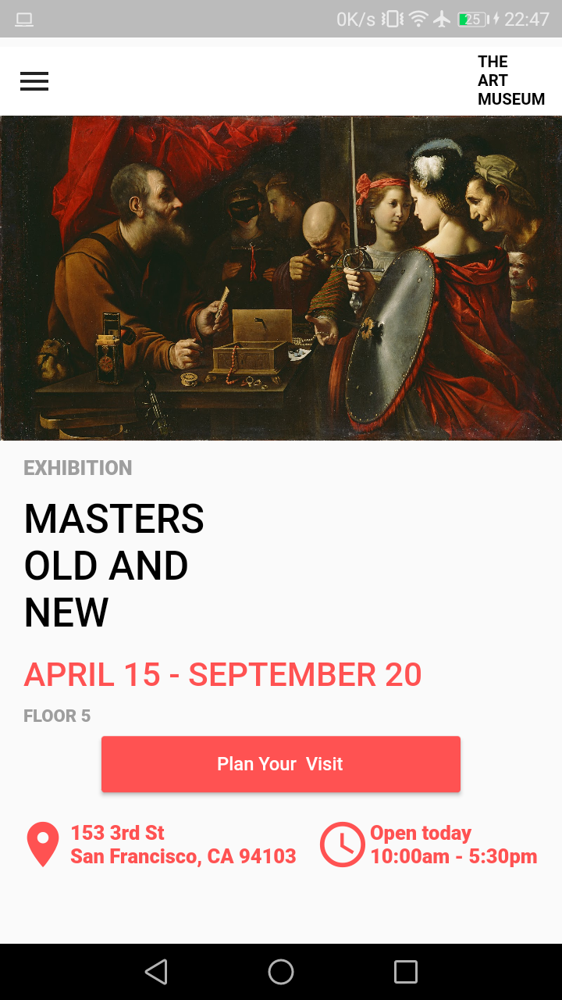
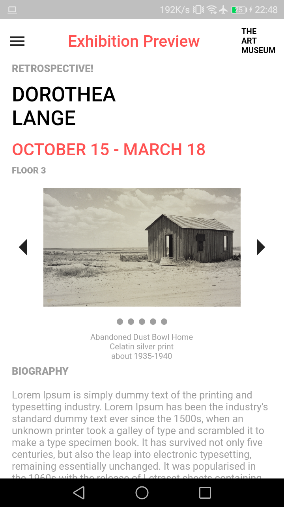

# Figma 

Proyecto basado en el Sample File de Figma (https://www.figma.com) en Flutter.

## Getting Started

Este proyecto se realizo por diversion y para probar el SDK de FLutter. 
Algunos recursos para iniciar tu primer proyecto en flutter: 

- [Lab: Write your first Flutter app](https://flutter.io/docs/get-started/codelab)
- [Cookbook: Useful Flutter samples](https://flutter.io/docs/cookbook)

Si necesitas ayuda aqui su documentacion y algunos tutoriales:
[online documentation](https://flutter.io/docs)

# Capturas de la aplicación
Login Page

Home Page

Exhibition Page

#Proyecto similar en RN
Pasate a ver el mismo proyecto realizado en React Native!
- [React Native Figma](https://github.com/CrisRonda/rnFigma)
